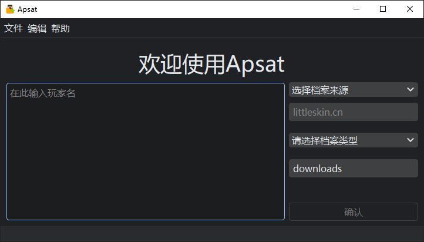

# 介绍

该软件名叫 Automated Player Skin Acquisition Tool(下文简写为Apsat) 

Apsat 是一款用于保存 Minecraft 玩家 (包括 Microsoft账户 与 第三方Yggdrasil账户) 档案下的自定义皮肤、披风与完整档案的GUI工具

## 特性

- 他可以做到批量保存、一键保存自定义皮肤、披风与完整档案
- 具有深色、浅色模式
- 可保存上次使用的 Yggdrasil API 地址以及下载地址
- 具有较为友好的GUI界面

> #### Apsat的GUI
> 
> 

>     
运行于 Windows10 19045.7663

>     
> 
