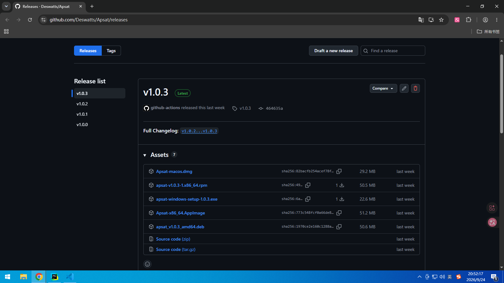
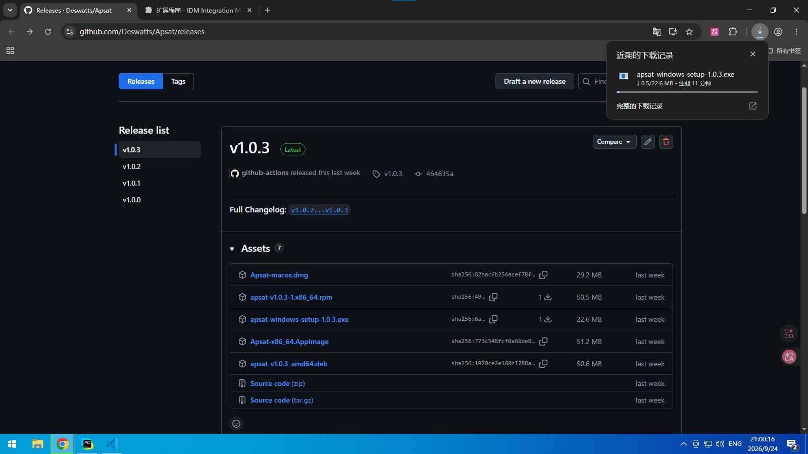

# GitHub Release

指在 Apsat 的 [GitHub Release](https://github.com/Deswatts/Apsat/releases) 里直接下载成品安装器

## 示例

1. 打开 [GitHub Release](https://github.com/Deswatts/Apsat/releases)

2. 下载符合自身操作系统的安装器(以 [apsat-windows-setup-1.0.3.exe](https://github.com/Deswatts/Apsat/releases/download/v1.0.3/apsat-windows-setup-1.0.3.exe) 为例)

3. 下载完成后按提示安装即可