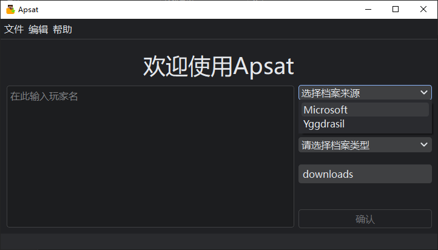
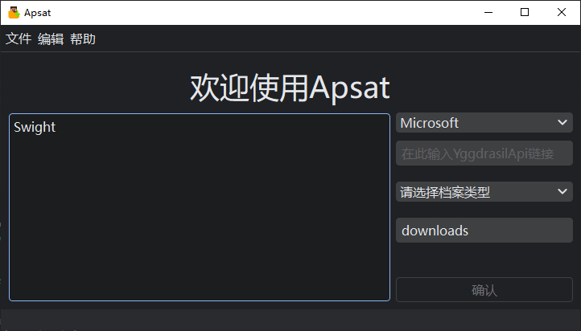
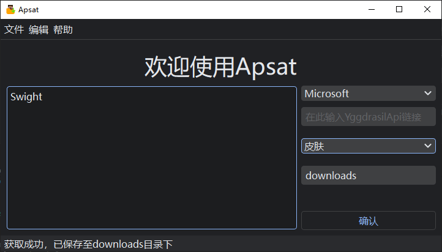
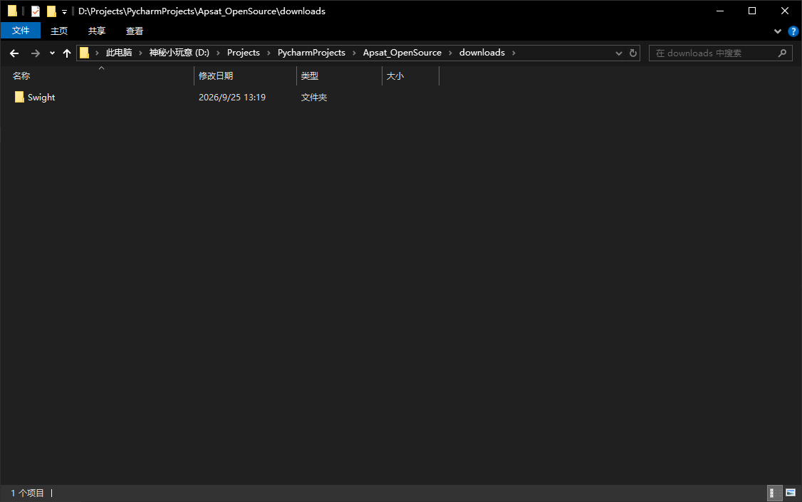
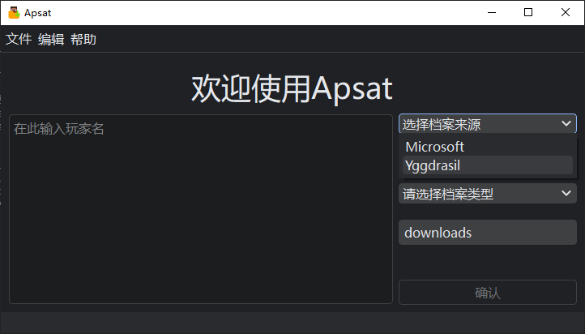
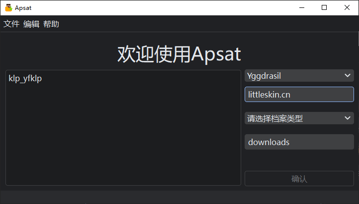
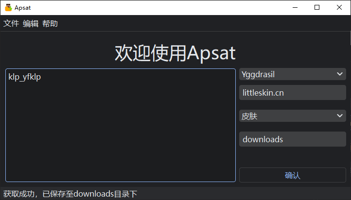
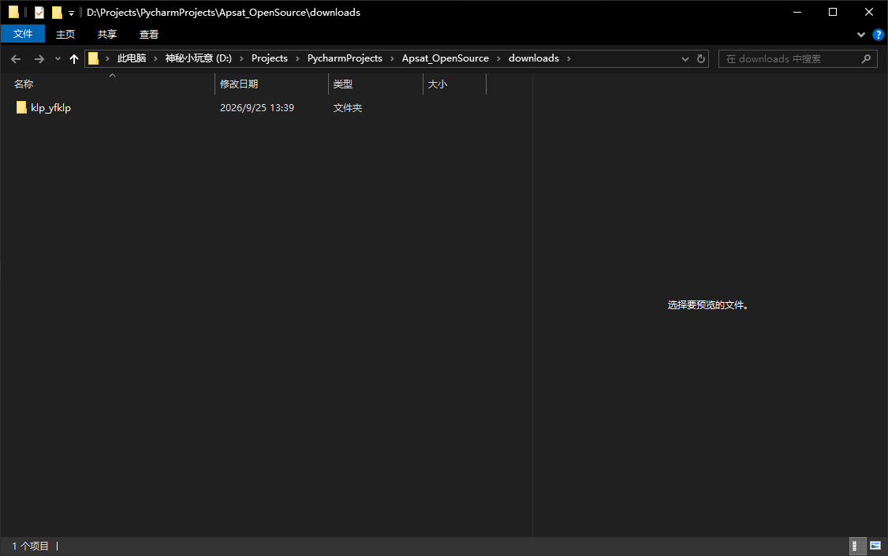

# 使用

## 1. 获取正版账号的皮肤

1. 选择档案来源为 Microsoft

[]

 

2. 输入你需要的玩家名

[]

 

3. 选择保存类型并输入保存文件夹

[]

 

4. 点击 菜单栏-文件-打开下载文件夹 打开上次保存的文件夹, 上次保存的文件存储在与上次保存的玩家名同名文件夹内

[]

 

## 2. 获取第三方登录账号的皮肤

1. 选择档案来源为 Yggdrasil

[]

 

2. 输入你需要的玩家名

[]

 

3. 输入验证服务器的 Yggdrasil API 地址（如果验证服务器支持[ALI](#ali), 仅需输入域名）

[]

 

4. 选择保存类型并输入保存文件夹

[]

 

5. 点击 菜单栏-文件-打开下载文件夹 打开上次保存的文件夹, 上次保存的文件存储在与上次保存的玩家名同名文件夹内

[]

 

## 注解

### ALI
API 地址指示（API Location Indication，简称 ALI）是一个 HTTP 响应头字段 `X-Authlib-Injector-API-Location`，起到服务发现的作用。ALI 的值为相对 URL 或绝对 URL，它指向与当前页面相关联的 Yggdrasil API。 

(该注解来自 [authlib-injector 的官方文档](https://yushijinhun.github.io/authlib-injector/zh/Yggdrasil-%E6%9C%8D%E5%8A%A1%E7%AB%AF%E6%8A%80%E6%9C%AF%E8%A7%84%E8%8C%83.html#api-%E5%9C%B0%E5%9D%80%E6%8C%87%E7%A4%BAali) 的其中一个片段, 并未删改, 原文使用 [CC-BY-SA-4.0](https://creativecommons.org/licenses/by-sa/4.0/legalcode) 协议许可)